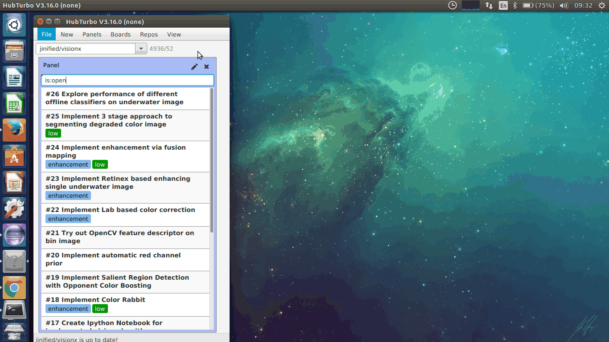

## A Basic Issue Creator

Follows the design of LabelPicker by using wrapped GitHub Service to create new issue. It currently only supports sending `title` 
and `body`. 

## Design 
Uses SceneBuilder to generate `fxml` file that is stored in `src/main/resources/ui/fxml`. The view will serve as the root container 
for future UI element for task such as `allocate assignee` ...

## Features planned 

Issue 
- edit issue
- close issue
- reopen issue 

Sidebar
- allocate assignee 
- attach labels 
- set milestone

Main editor 
- Markdown preview on a separate pane using WebView and `pegdown` as markdown processor
- supports referencing to `users` and `issues`

Comments
- show all comments
- edit comment
- delete comment 

Advanced 
- autocomplete for relevant keywords 

